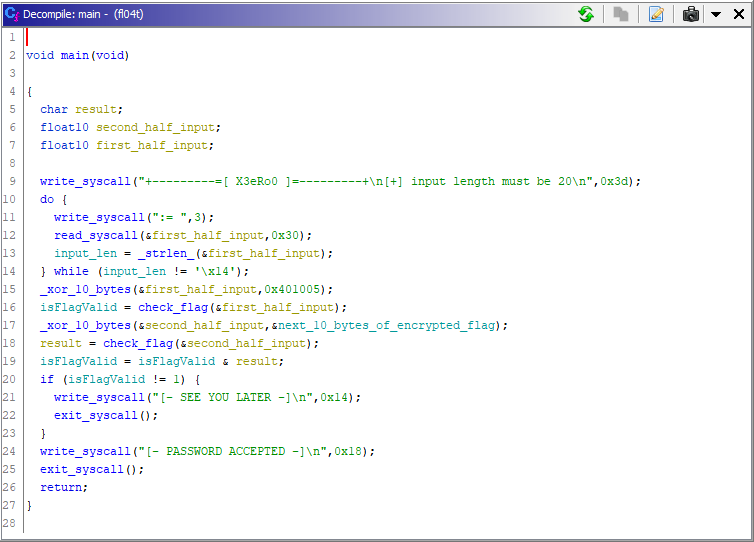
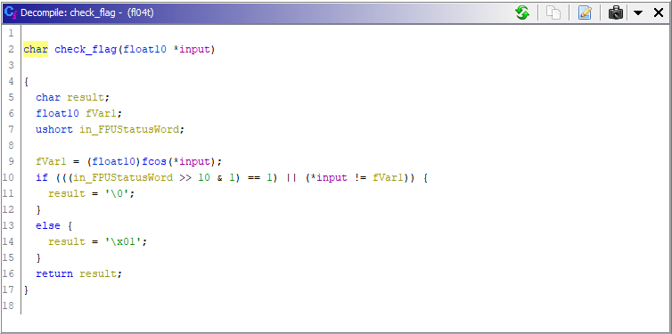
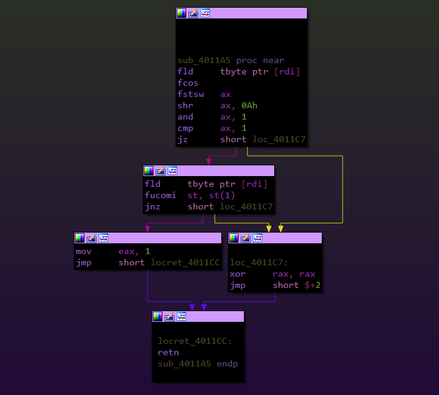
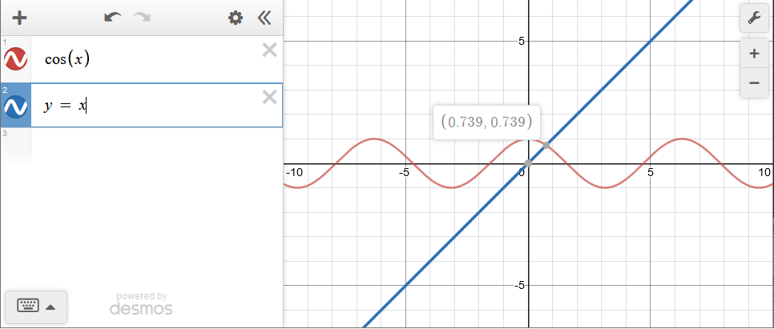

### fl04t
---

 - Author : [X3eRo0](https://x3ero0.tech/crackmes/)
 - Language : Assembler
 - Upload : Fri, 29 May 2020 05:09:29
 - Difficulty: 3
 - Platform : Unix/Linux etc.
 - Crackme : [fl04t](https://x3ero0.tech/crackmes/fl04t/)

```plaintext
Desc: 

   - Find the correct password which prints [- PASSWORD ACCEPTED -]
   - Written in x86_64 asm
   - Don't patch the binary, of course - find the correct input.

  SHA256: c5d23382b4fe9ed760a09d8346311d3bbbbbaf48311906912bb52fc77d903786  fl04t
```
---


Hey there!
Another day, another crackme. This time we have a fl04t crackme. Lets start by doing the initial recon.
```plaintext
--------------------------------------------------------------------------------------------------------------------------------------
/c/Users/X3eRo0/Desktop/asm/fl04t_x3ero0 » ls -las                                                                       x3ero0@x3ero0
total 16
 0 drwxrwx--- 1 root vboxsf    0 Jun  7 05:56 .
 4 drwxrwx--- 1 root vboxsf 4096 Jun  7 05:56 ..
12 -rwxrwx--- 1 root vboxsf 8480 Jun  7 05:55 fl04t
--------------------------------------------------------------------------------------------------------------------------------------
/c/Users/X3eRo0/Desktop/asm/fl04t_x3ero0 »
```
As you can see the binary just around 2KB.
```plaintext
--------------------------------------------------------------------------------------------------------------------------------------
/c/Users/X3eRo0/Desktop/asm/fl04t_x3ero0 » ./fl04t                                                                      x3ero0@x3ero0
+---------=[ X3eRo0 ]=---------+
[+] input length must be 20
:= float?
:= let_me_in___let_me_in
:= AAAAAAAAAAAAAAAAAAAAAAAAAAAAAAAAAAAAAAAAAAAAAAAAAAAAAAAAAAAAAAAAAAAAAAAAAAAAAAAAAAAAAAAAAAAAAAAAAAAAAAAAAAAAAAA
:= := := pls
:= wtf
:= 01234567890123456789
[- SEE YOU LATER -]
```
--------------------------------------------------------------------------------------------------------------------------------------
Seems like it only checks the password if the length is 0x14 Bytes.


Lets open it in Ghidra, already analysed the code and labeled them accordingly.




Looking at the main() function, we see that our input is 20 Bytes and they are divided in 2 blocks of 10 bytes each. The checking is done like this.


 1. xor first 10 bytes of input with with first 10 bytes of encrypted flag.
 2. result of check_flag(first_half_of_input); is stored in a global variable isFlagValid;
 3. next 10 bytes of input are then xored with the next 10 bytes of encrypted flag
 4. result of check_flag(second_half_of_input); is binary anded (&) with the isFlagValid.
 5. if isFlagValid is not equal to 1 then print "SEE YOU LATER"
 6. otherwise print "PASSWORD ACCEPTED"
 
 The goal is clear the correct flag will result in a sequence of bytes that when passed to the check_flag() returns 1.


---
## Check_flag(long double * input)

Lets look at check_flag()


Ghidra recognized the argument to the function as a pointer to float10. If we see the assembly its actually 
tword (10 Bytes) or in C a long double.


```x86
FLD        tword ptr [input]
```


We know that x86 has a completely different set of registers and cpu for floats, i,e. FPU.

<br>

```plaintext
FLD:
    > Loads the given tword in st(0) floating point register.
```


If we follow the disassembly, we see that our input (in rdi) is loaded in the st(0) floating point register.
then fcos instruction is executed.


```plaintext
FCOS:
    > Calculates the approximate cosine value of st(0) and puts the result back in st(0).
    > If the value is st(0) is outside the acceptable range (−2^63 to +2^63) a special flag (C2 flag) in the FPUStatusWord is set. This flag is the 10th bit in the FPUStatusWord.
    > In case C2 flag is set the st(0) remains unchanged.
```

Then ``fstsw ax``  is executed. 

```plaintext
FSTSW ax:
     > Store FPU status word in AX register after
       checking for pending unmasked floating-point
       exceptions.
```

So the binary shifts this FPUStatusWord right by 10 bits and checks if C2 flag is set. If it is set that means the input is out of valid range. 
The check_flag() function checks if the input tword is in the valid range or not. if its not then it returns 0.
other wise it again loads the input in the register stack, this time the value will be in st(1) as st(0) is already occupied. Finally ``fucomi st, st(1)`` is executed.


```plaintext
FUCOM:
   > Compare ST(0) with ST(1).
```

So basically, the cosine of our input is calculated and then checked if its equal to our input or not.

``cos(input) == input ?``


---
## Solving The Equation

So the solution of this crackme boils down to this equation
``cos(x) == x``



Desmos graph tells us a not so precise solution of the equation rounded upto 3 decimal places, but in order to get the correct long double so that fcos(input) == input we need a precise solution. To find the solution i made a simple C program to find the solution using binary search or bisection. The concept is that we keep on dividing the search space to half until we find the solution. You can find a lot of resources on this technique online.

```c
#include <stdio.h>
#include <math.h>
#include <string.h>

void print_mem(char *mem, int len){

    for (int i = 0; i < len; i++){
        printf("\\x%.2X", *(unsigned char *)(mem + i));
    }
    printf("\n");

}

int main(){

    long double right = 1.5707963267948966;
    long double left  = 0.00000;
    long double midd  = (left + right)/ 2;
    long double ress  = cosl(midd);
    int i = 0;
    printf("midd: %Lf\n", midd);
    printf("numm: %Lf\n", number);
    while(memcmp((char *)&ress, (char *)&midd, 10) != 0){

        if(midd > ress){
            right  = midd;
        }
        if(midd < ress){
            left = midd;
        }
        midd = (left + right) / 2;
        ress = cosl(midd);

    }

    printf("midd: %Lf\n", midd);
    print_mem((char *)&midd, 10);
    printf("ress: %Lf\n", ress);
    print_mem((char *)&ress, 10);

}
```
This gives the exact 10 Byte value of the solution. 

```c
---------------------------------------------------------------------------------------------
/c/Users/X3eRo0/Desktop/asm » ./a.out                                          x3ero0@x3ero0 
midd: 0.739085
"\xCB\x6D\x71\x1E\xEC\xAE\x34\xBD\xFE\x3F"
ress: 0.739085
"\xCB\x6D\x71\x1E\xEC\xAE\x34\xBD\xFE\x3F"
---------------------------------------------------------------------------------------------
/c/Users/X3eRo0/Desktop/asm »
```

The Decimal values are useless to us because 

```plaintext
float lesson number 06: 
            never ever use decimal representation for floats
            if you need a precise float value :) that's because
            floats are binary; and in fractional numbers decimals
            and binary numbers differ in what can be expressed 
            e.g number 0.1 <-- perfectly sane in decimal is not
            expressable in binary it requires infinite number of 
            digits.
```

Now that we know what is the correct value we can xor these bytes with the encrypted bytes in the binary
to get the flag.

```python
solution  = "\xCB\x6D\x71\x1E\xEC\xAE\x34\xBD\xFE\x3F"
enc_bytes = [
    "\xAD\x1F\x41\x73\xB3\xC8\x58\x8D\xCA\x4B",
    "\xB8\x32\x40\x73\x9C\x9E\x46\xC9\xA1\x15"
]

def xor(data, key):
    res = ""
    if len(data) != len(key):
        return res
    for i in range(10):
        res += chr(ord(data[i]) ^ ord(key[i]))
    return res

flag = ""

for enc_byte in enc_bytes:
    flag += xor(enc_byte, solution)

print(flag)
```

This gives us the flag ``fr0m_fl04ts_1mp0rt_*``