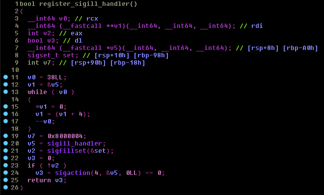
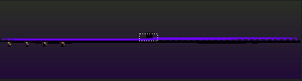
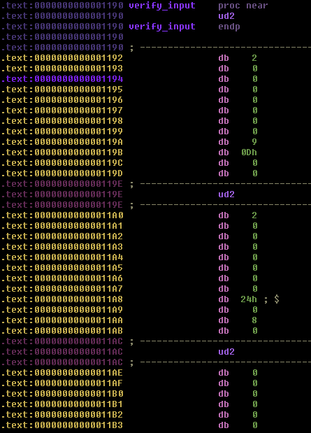

### Hell86
---

 - Author : [ttlhacker](https://crackmes.one/user/ttlhacker)
 - Language : Assembler
 - Upload : 8:03 PM 10/12/2018
 - Level : 3
 - Platform : Unix/Linux etc.
 - Crackme : [crackmes.one](https://crackmes.one/crackme/5bc0fe0033c5d4110a29b296)

```plaintext
Desc: 

   - x86_64 linux binary (tested on debian 9 and ubuntu 18.04, should run on any distro).
   - Takes one command line argument and outputs "OK!" if it's correct, "Wrong" if it's not.
   - Partially written in C, actual verification routine is assembly.
   - Don't patch the binary, of course - find the correct input.

  SHA256: 134b53b78fe74d477bf381ebfd965f92d270f8314886518d451ec3aca29156fa hell86
```

---


hell86 is a super awesome crackme by [ttlhacker](https://crackmes.one/user/ttlhacker) on [crackmes.one](https://crackmes.one/). it implements VM in an unusual and creative way using signals and stuff. Lets start our analysis by running it.

Lets start by giving a random input to our crackme.


So, as we can see the binary takes input using argv
and throws an error if no argument is passed.

Lets trace the binary using ltrace and see what it does.

```plaintext
_ZNSt8ios_base4InitC1Ev(0x55b4f3a8b881, 0x7ffe79e0e7b8, 0x7ffe79e0e7d0, 224) = 0
__cxa_atexit(0x7f06e2a07990, 0x55b4f3a8b881, 0x55b4f3a8b068, 6) = 0
malloc(8192)                                     = 0x55b4f497feb0
sigaltstack(0x7ffe79e0e688, 0, 0, 0)             = 0
sigfillset(~<31-32>)                             = 0
sigaction(SIGILL, { 0x55b4f3889946, ~<31-32>, 0xffffffff, 0xffffffffffffffff }, nil) = 0
--- SIGILL (Illegal instruction) ---
--- SIGILL (Illegal instruction) ---
--- SIGILL (Illegal instruction) ---
.....                           .....
.....                           .....
.....                           .....
--- SIGILL (Illegal instruction) ---
--- SIGILL (Illegal instruction) ---
--- SIGILL (Illegal instruction) ---
puts("Wrong")                                    = 6
Wrong
+++ exited (status 0) +++

```


The ltrace output tells us that a lot of SIGILL signals were raised. We will take a look at why but first lets see what is SIGILL and is this a normal behavior?

 - **SIGILL** : is a Linux signal that is raised when an ILLEGAL instruction is encountered. By default it terminates the program.
 - **THIS IS NOT NORMAL** : When a program receives SIGILL it should terminate unlike hell86 which is raising multiple SIGILLs.
 
 So, What the Hell is going on?

This behavior can only be explained if there is a signal handler to handle this "SIGILL".
A normal program terminates like this


Lets open the binary in IDA Pro.


As you can see ``main()`` is just calling other functions to do the actual stuff. Lets take a look at all of these one by one.

First lets see ``init_sigaltstack()``


In this function ``init_sigaltstack()`` the program is allocating 0x2000 Bytes in the heap to use as an alternate stack. Then it initializes a stack_t structure 
```c
/* Structure describing a signal stack.  */
typedef struct
  {
    void *ss_sp;
    int ss_flags;
    size_t ss_size;
  } stack_t;
```

and finally it calls ``sigaltstack()``. This new stack will only be used when a signal handler of any signal is executing. The stack pointer will point to this new stack in heap while the signal handler is in control.
if the call to ``sigaltstack()`` fails, then we call ``free()`` to free the allocated memory.

Now lets look at ``register_sigill_handler()``



and this is the same function from the actual source

```c
bool register_sigill_handler() {
    struct sigaction sa = {};
    sa.sa_sigaction = sigill_handler;
    sa.sa_flags = SA_ONSTACK | SA_SIGINFO;
    if (sigfillset(&sa.sa_mask) != 0) {
        return false;
    }
    return sigaction(SIGILL, &sa, nullptr) == 0;
}
```

here ``sigill_handler`` is the pointer to the SIGILL handler function. It is initializing the ``sigaction`` struct to call ``sigaction()``. Now whenever a SIGILL is raised we will call this handler function instead of terminating the program and this is the reason why we saw all those SIGILLs in the ltrace output.


Now lets take a look at ``sigill_handler``


``loc_1ee0:``


As you can see ``sigill_handler()`` is just a huge switch case with opcode of the VM instructions as the switch parameter.



---
### The Bytecode

Now lets go back to main and take a look at ``verify_input()``

we will analyze this function in text view



Look what we found, the actual reason of SIGILLs. These are UD2 instructions which basically raise Illegal instruction signal or SIGILL. There are some more bytes after each ``UD2(\x0f\x0b)`` instruction.


---

### Instruction Encoding

The instructions are encoding in hell86 is actually one simple thing in this challenge.
Each instruction has an 8 byte immediate value which lies just after the ``UD2``.
```plaintext
\x0f\x0b   - UD2
\x00 * 0x8 - imm64
\x09       - Opcode
\x00       - arg1
\x00       - arg2
\x00       - arg3 
```

The structure would look like this :
```c
/* hell86 instructions */
typedef struct{
   uint16_t ud2;
   int64    imm64;
   char     opcode;
   char     arg1;
   char     arg2;
   char     arg3;
} hell86_instr;
```
---

### VM Instructions

Lets hop back to IDA and look at the switch case in text view and figure out where are the VM registers, i haven't seen any mention of VM registers or stack or even ROM. 

Lets start with case 9 as its the first case that the VM executes in IDA.
``case 9:``


Looks like there is an array of 64 bit numbers at ``rsi`` (could it be an array of registers?)

Lets use ``gdb`` to break at this instruction and analyze the values of the registers.


As you can see ``rsi`` points on the stack or should i say the new stack. So this is the part which  i am not so sure about. I think whenever a signal is raised the ``sigcontext`` structure is pushed on the ``altstack`` and its this structure where ``rsi`` is pointing at. if we see the ``sigcontext`` 
struct.


```c
/*
 * The 64-bit signal frame:
 */
struct sigcontext_64 {
  __u64       r8;
  __u64       r9;
  __u64       r10;
  __u64       r11;
  __u64       r12;
  __u64       r13;
  __u64       r14;
  __u64       r15;
  __u64       di;
  __u64       si;
  __u64       bp;
  __u64       bx;
  __u64       dx;
  __u64       ax;
  __u64       cx;
  __u64       sp;
  __u64       ip;
  __u64       flags;
  __u16       cs;
  __u16       gs;
  __u16       fs;
  __u16       ss;
  __u64       err;
  __u64       trapno;
  __u64       oldmask;
  __u64       cr2;

  /*
   * fpstate is really (struct _fpstate *) or (struct _xstate *)
   * depending on the FP_XSTATE_MAGIC1 encoded in the SW reserved
   * bytes of (struct _fpstate) and FP_XSTATE_MAGIC2 present at the end
   * of extended memory layout. See comments at the definition of
   * (struct _fpx_sw_bytes)
   */
  __u64       fpstate; /* Zero when no FPU/extended context */
  __u64       reserved1[8];
};
```

This structure is pushed on the stack whenever a signal is raised by the Operating System, and this same structure is then used by sigreturn syscall to restore the values through this structure.


You know what this means? this VM doesnt even uses virtual registers. IT USES
ACTUAL x86_64 register ``BRUH MOMENT``

---

### The Disassembler

Okay, Now that we understand everything (almost), lets get the disassmbler working.
The following disassembler is just to disassemble the instructions which the VM was
using. I didn't implemented the ones which were not used.

After looking at the instructions which the VM was using, i found out that there were total 50 instructions implemented while only 44 were used.

Also there were some imm64 values which were used as an operand for ``jmp`` and ``call`` instructions for example ``malloc()`` and ``free()`` are one of them. these addresses were placed in the bytecode so i just dumped the bytecode using gdb.

disass.py
```python
from struct import unpack

MALLOC = 0x7ffff7b1c260
FREE   = 0x7ffff7b1c850

op_addrs = [
    0x1a1f,
    0x1a20,
    0x1a39,
    0x1a52,
    0x1a6c,
    0x1a87,
    0x1aa2,
    0x1abe,
    0x1ae6,
    0x1ada,
    0x1afa,
    0x1b12,
    0x1b2b,
    0x1b43,
    0x1b5c,
    0x1b73,
    0x1b8b,
    0x1ba3,
    0x1bba,
    0x1bd2,
    0x1be9,
    0x1c01,
    0x1c1a,
    0x1c2e,
    0x1c43,
    0x1c54,
    0x1c6d,
    0x1c86,
    0x1c9f,
    0x1cb3,
    0x1cd2,
    0x1cf1,
    0x1d10,
    0x1d2f,
    0x1d4e,
    0x1d6d,
    0x1d87,
    0x1da1,
    0x1db9,
    0x1dcf,
    0x1de5,
    0x1e07,
    0x1e9c,
    0x1ebe,
    0x1e1e,
    0x1e32,
    0x1e49,
    0x1e60,
    0x1e74,
    0x1e88
]

registers = {
    0 : "r8",
    1 : "r9",
    2 : "r10",
    3 : "r11",
    4 : "r12",
    5 : "r13",
    6 : "r14",
    7 : "r15",
    8 : "rdi",
    9 : "rsi",
    10 : "rbp",
    11 : "rbx",
    12 : "rdx",
    13 : "rax",
    14 : "rcx",
    15 : "sp",
    16 : "pc"  
}


bytecode = open("bytecode", "rb").read()#[0x1190:0x1946]

for i in range(0, len(bytecode), 0xE):
    instruction = bytecode[i+2:i+0xe]
    opcode = ord(instruction[8])
    arg1   = ord(instruction[9])
    arg2   = ord(instruction[10])
    arg3   = ord(instruction[11])

    imm    = unpack("Q", instruction[0: 8])[0]
    #tmp = "".join([("\\x%.2X" % ord(x)) for x in instruction])
    dis = "%.4i: [%.2i][ %.4x ][ %.4x ] " % (i, opcode, op_addrs[opcode], 0x1190 + i)
    #dis = "%.4x: [%.4x] %s\t" % (i, 0x1190 + i, tmp)

    if   opcode == 9:
        if imm & 0x555555550000:
            imm = imm - 0x555555554000
        if registers[arg1] == "pc":
            dis +=  "jmp 0x%.4x" % (imm)
        else:
            dis +=  "%s = 0x%.4x" % (registers[arg1], imm)
    elif opcode == 36:
        dis +=  "if %s != 0x%.4x: %s = 1; else: %s = 0;" % (registers[arg2], imm, registers[arg1], registers[arg1])
    elif opcode == 37:
        dis +=  "if %s == 0: %s = 1;" % (registers[arg2], registers[arg1])
    elif opcode == 1:
        dis +=  "%s = %s + %s" % (registers[arg1], registers[arg2], registers[arg3])
    elif opcode == 2:
        dis +=  "%s = %s - %s" % (registers[arg1], registers[arg2], registers[arg3])
    elif opcode == 3:
        dis +=  "%s = %s * %s" % (registers[arg1], registers[arg2], registers[arg3])
    elif opcode == 4 or opcode == 5:
        dis +=  "%s = %s / %s" % (registers[arg1], registers[arg2], registers[arg3])
    elif opcode == 6:
        dis +=  "%s = %s >> %s" % (registers[arg1], registers[arg2], registers[arg3])
    elif opcode == 7:
        dis +=  "%s = %s << %s" % (registers[arg1], registers[arg2], registers[arg3])
    elif opcode == 8:
        dis +=  "%s = ~%s" % (registers[arg1], registers[arg2])
    elif opcode == 10 or opcode == 11:
        dis +=  "(WORD)  %s = BYTE  [%s + 0x%.4x]" % (registers[arg1], registers[arg2], imm)
    elif opcode == 11:
        dis +=  "(QWORD) %s = BYTE  [%s + 0x%.4x]" % (registers[arg1], registers[arg2], imm)
    elif opcode == 12:
        dis +=  "(DWORD) %s = WORD  [%s + 0x%.4x]" % (registers[arg1], registers[arg2], imm)
    elif opcode == 13:
        dis +=  "(QWORD) %s = WORD  [%s + 0x%.4x]" % (registers[arg1], registers[arg2], imm)
    elif opcode == 14:
        dis +=  "(DWORD) %s = QWORD [%s + 0x%.4x]" % (registers[arg1], registers[arg2], imm)
    elif opcode == 15:
        dis +=  "(QWORD) %s = DWORD [%s + 0x%.4x]" % (registers[arg1], registers[arg2], imm)
    elif opcode == 16:
        if imm & 0xffffffffffffff00:
            imm = 0x10000000000000000 - imm
            dis +=  "(QWORD) %s = DWORD [%s - 0x%.4x]" % (registers[arg1], registers[arg2], imm)
        else:
            dis +=  "(QWORD) %s = DWORD [%s + 0x%.4x]" % (registers[arg1], registers[arg2], imm)
    elif opcode == 17:
        dis +=  "[%s + 0x%.4x] = %s & 0xff" % (registers[arg1], registers[arg2], imm)
    elif opcode == 18:
        dis +=  "[%s + 0x%.4x] = %s & 0xffff" % (registers[arg1], registers[arg2], imm)
    elif opcode == 19:
        dis +=  "[%s + 0x%.4x] = %s & 0xffffffff" % (registers[arg1], registers[arg2], imm)
    elif opcode == 20:
        if imm & 0xffffffffffffff00:
            imm = 0x10000000000000000 - imm
            dis +=  "[%s - 0x%.4x] = %s" % (registers[arg2], imm, registers[arg3])
        else:
            dis +=  "[%s + 0x%.4x] = %s" % (registers[arg2], imm, registers[arg3])
    elif opcode == 21:
        dis +=  "push %s" % (registers[arg2])
    elif opcode == 22:
        dis +=  "push 0x%.4x" % (imm)
    elif opcode == 23:
        dis +=  "pop %s" % (registers[arg1])
    elif opcode == 24:
        dis +=  "%s = %s" % (registers[arg1], registers[arg2])
    elif opcode == 25:
        dis +=  "%s = %s | %s" % (registers[arg1], registers[arg2], registers[arg3])
    elif opcode == 26:
        dis += "%s = %s & %s" % (registers[arg1], registers[arg2], registers[arg3])
    elif opcode == 27:
        dis += "%s = %s ^ %s" % (registers[arg1], registers[arg2], registers[arg3])
    elif opcode == 28:
        dis += "%s = ! %s" % (registers[arg1], registers[arg2])
    elif opcode == 29:
        pass
    elif opcode == 33:
        dis += "if %s ==  %s: %s = 1" % (registers[arg3], registers[arg2], registers[arg1])
    elif opcode == 38:
        if imm & 0x555555550000:
            imm = imm - 0x555555554000
        dis += "if %s == 0; jmp 0x%.4x" % (registers[arg2], imm)
    elif opcode == 39:
        if imm & 0x555555550000:
            imm = imm - 0x555555554000
        dis += "if %s != 0; jmp 0x%.4x" % (registers[arg2], imm)
    elif opcode == 40:
        if imm == FREE: # free
            dis += "call %s" % ("free")
        elif imm == MALLOC: # malloc
            dis += "call %s" % ("malloc")
        else:
            if imm & 0x555555550000:
                imm = imm - 0x555555554000
            dis += "call 0x%.4x" % (imm)
    elif opcode == 41:
        dis += "return"
    elif opcode == 42:
        dis +=  "if %s != 0; return" % (registers[arg2])
    elif opcode == 43:
        dis += "if %s == 0; return" % (registers[arg2])
    elif opcode == 44:
        if imm & 0xffffffffffffff00:
            imm = 0x10000000000000000 - imm
            dis +=  "%s = %s - 0x%.4x" % (registers[arg1], registers[arg2], imm)
        else:
            dis +=  "%s = %s + 0x%.4x" % (registers[arg1], registers[arg2], imm)
    elif opcode == 45:
        dis += "%s = %s >> 0x%.4x" % (registers[arg1], registers[arg2], (imm & 0xff))
    elif opcode == 46:
        dis += "%s = %s << 0x%.4x" % (registers[arg1], registers[arg2], (imm & 0xff))
    elif opcode == 47:
        dis += "%s = %s | 0x%.4x" % (registers[arg1], registers[arg2], imm)
    elif opcode == 48:
        dis += "%s = %s & 0x%.4x" % (registers[arg1], registers[arg2], imm)
    elif opcode == 49:
        dis += "%s = %s ^ 0x%.4x" % (registers[arg1], registers[arg2], imm)
    else:
        dis +=  "%s" % ("UNKNOWN")

    print dis
```


After running this you will get this disassembly


```plaintext
0000: [09][ 1ada ][ 1190 ] rax = 0x0002                                
0014: [36][ 1d87 ][ 119e ] if rdi != 0x0002: r8 = 1; else: r8 = 0;     
0028: [42][ 1e9c ][ 11ac ] if r8 != 0; return                          
0042: [44][ 1e1e ][ 11ba ] rsi = rsi + 0x0008                          
0056: [16][ 1b8b ][ 11c8 ] (QWORD) rdi = DWORD [rsi + 0x0000]          
0070: [09][ 1ada ][ 11d6 ] jmp 0x11e4                                  
0084: [21][ 1c01 ][ 11e4 ] push rbp                                    
0098: [24][ 1c43 ][ 11f2 ] rbp = sp                                    
0112: [44][ 1e1e ][ 1200 ] sp = sp - 0x0010                            
0126: [20][ 1be9 ][ 120e ] [rbp - 0x0010] = rdi                        
0140: [40][ 1de5 ][ 121c ] call 0x17da                                 
0154: [36][ 1d87 ][ 122a ] if rax != 0x0024: rax = 1; else: rax = 0;   
0168: [39][ 1dcf ][ 1238 ] if rax != 0; jmp 0x13ce                     
0182: [09][ 1ada ][ 1246 ] rdi = 0x20cd                                
0196: [40][ 1de5 ][ 1254 ] call 0x17da                                 
0210: [20][ 1be9 ][ 1262 ] [rbp - 0x0008] = rax                        
0224: [16][ 1b8b ][ 1270 ] (QWORD) rdi = DWORD [rbp - 0x0010]          
0238: [09][ 1ada ][ 127e ] rsi = 0x20cd                                
0252: [24][ 1c43 ][ 128c ] rdx = rax                                   
0266: [40][ 1de5 ][ 129a ] call 0x182e                                 
0280: [39][ 1dcf ][ 12a8 ] if rax != 0; jmp 0x13ce                     
0294: [16][ 1b8b ][ 12b6 ] (QWORD) rdi = DWORD [rbp - 0x0010]          
0308: [10][ 1afa ][ 12c4 ] (WORD)  rsi = BYTE  [rdi + 0x0023]          
0322: [36][ 1d87 ][ 12d2 ] if rsi != 0x007d: rsi = 1; else: rsi = 0;   
0336: [39][ 1dcf ][ 12e0 ] if rsi != 0; jmp 0x13ce                     
0350: [16][ 1b8b ][ 12ee ] (QWORD) rsi = DWORD [rbp - 0x0008]          
0364: [01][ 1a20 ][ 12fc ] rdi = rdi + rsi                             
0378: [08][ 1ae6 ][ 130a ] rsi = ~rsi                                  
0392: [44][ 1e1e ][ 1318 ] rsi = rsi + 0x0023                          
0406: [21][ 1c01 ][ 1326 ] push rsi                                    
0420: [40][ 1de5 ][ 1334 ] call 0x1406                                 
0434: [23][ 1c2e ][ 1342 ] pop rsi                                     
0448: [38][ 1db9 ][ 1350 ] if rax == 0; jmp 0x13ce                     
0462: [24][ 1c43 ][ 135e ] rdi = rax                                   
0476: [21][ 1c01 ][ 136c ] push rdi                                    
0490: [40][ 1de5 ][ 137a ] call 0x15fe                                 
0504: [23][ 1c2e ][ 1388 ] pop rdi                                     
0518: [21][ 1c01 ][ 1396 ] push rax                                    
0532: [40][ 1de5 ][ 13a4 ] call free                                   
0546: [23][ 1c2e ][ 13b2 ] pop rax                                     
0560: [09][ 1ada ][ 13c0 ] jmp 0x13dc                                  
0574: [09][ 1ada ][ 13ce ] rax = 0x0001                                
0588: [24][ 1c43 ][ 13dc ] sp = rbp                                    
0602: [23][ 1c2e ][ 13ea ] pop rbp                                     
0616: [41][ 1e07 ][ 13f8 ] return                                      
0630: [09][ 1ada ][ 1406 ] rax = 0x0000                                
0644: [43][ 1ebe ][ 1414 ] if rsi == 0; return                         
0658: [21][ 1c01 ][ 1422 ] push rdi                                    
0672: [21][ 1c01 ][ 1430 ] push rsi                                    
0686: [46][ 1e49 ][ 143e ] rdi = rsi << 0x0003                         
0700: [40][ 1de5 ][ 144c ] call malloc                                 
0714: [23][ 1c2e ][ 145a ] pop rsi                                     
0728: [23][ 1c2e ][ 1468 ] pop rdi                                     
0742: [43][ 1ebe ][ 1476 ] if rax == 0; return                         
0756: [24][ 1c43 ][ 1484 ] r8 = rax                                    
0770: [24][ 1c43 ][ 1492 ] r9 = rax                                    
0784: [21][ 1c01 ][ 14a0 ] push r9                                     
0798: [21][ 1c01 ][ 14ae ] push r8                                     
0812: [21][ 1c01 ][ 14bc ] push rdi                                    
0826: [21][ 1c01 ][ 14ca ] push rsi                                    
0840: [10][ 1afa ][ 14d8 ] (WORD)  rsi = BYTE  [rdi + 0x0000]          
0854: [09][ 1ada ][ 14e6 ] rdi = 0x20a0                                
0868: [40][ 1de5 ][ 14f4 ] call 0x18c8                                 
0882: [23][ 1c2e ][ 1502 ] pop rsi                                     
0896: [23][ 1c2e ][ 1510 ] pop rdi                                     
0910: [23][ 1c2e ][ 151e ] pop r8                                      
0924: [23][ 1c2e ][ 152c ] pop r9                                      
0938: [38][ 1db9 ][ 153a ] if rax == 0; jmp 0x15c6                     
0952: [09][ 1ada ][ 1548 ] r10 = 0x20a0                                
0966: [02][ 1a39 ][ 1556 ] rax = rax - r10                             
0980: [20][ 1be9 ][ 1564 ] [r9 + 0x0000] = rax                         
0994: [44][ 1e1e ][ 1572 ] r9 = r9 + 0x0008                            
1008: [44][ 1e1e ][ 1580 ] rdi = rdi + 0x0001                          
1022: [44][ 1e1e ][ 158e ] rsi = rsi - 0x0001                          
1036: [39][ 1dcf ][ 159c ] if rsi != 0; jmp 0x14a0                     
1050: [24][ 1c43 ][ 15aa ] rax = r8                                    
1064: [41][ 1e07 ][ 15b8 ] return                                      
1078: [24][ 1c43 ][ 15c6 ] rdi = r8                                    
1092: [40][ 1de5 ][ 15d4 ] call free                                   
1106: [09][ 1ada ][ 15e2 ] rax = 0x0000                                
1120: [41][ 1e07 ][ 15f0 ] return                                      
1134: [09][ 1ada ][ 15fe ] rax = 0x0001                                
1148: [43][ 1ebe ][ 160c ] if rsi == 0; return                         
1162: [16][ 1b8b ][ 161a ] (QWORD) r8 = DWORD [rdi + 0x0000]           
1176: [36][ 1d87 ][ 1628 ] if r8 != 0x0016: r8 = 1; else: r8 = 0;      
1190: [42][ 1e9c ][ 1636 ] if r8 != 0; return                          
1204: [21][ 1c01 ][ 1644 ] push rdi                                    
1218: [21][ 1c01 ][ 1652 ] push rsi                                    
1232: [40][ 1de5 ][ 1660 ] call 0x1724                                 
1246: [23][ 1c2e ][ 166e ] pop rsi                                     
1260: [23][ 1c2e ][ 167c ] pop rdi                                     
1274: [44][ 1e1e ][ 168a ] rsi = rsi - 0x0001                          
1288: [21][ 1c01 ][ 1698 ] push rdi                                    
1302: [46][ 1e49 ][ 16a6 ] rdx = rsi << 0x0003                         
1316: [09][ 1ada ][ 16b4 ] rsi = 0x1fa0                                
1330: [40][ 1de5 ][ 16c2 ] call 0x182e                                 
1344: [23][ 1c2e ][ 16d0 ] pop rdi                                     
1358: [24][ 1c43 ][ 16de ] r8 = rax                                    
1372: [09][ 1ada ][ 16ec ] rax = 0x0001                                
1386: [42][ 1e9c ][ 16fa ] if r8 != 0; return                          
1400: [09][ 1ada ][ 1708 ] rax = 0x0000                                
1414: [41][ 1e07 ][ 1716 ] return                                      
1428: [43][ 1ebe ][ 1724 ] if rsi == 0; return                         
1442: [44][ 1e1e ][ 1732 ] rsi = rsi - 0x0001                          
1456: [43][ 1ebe ][ 1740 ] if rsi == 0; return                         
1470: [16][ 1b8b ][ 174e ] (QWORD) r8 = DWORD [rdi + 0x0000]           
1484: [16][ 1b8b ][ 175c ] (QWORD) r9 = DWORD [rdi + 0x0008]           
1498: [02][ 1a39 ][ 176a ] r8 = r9 - r8                                
1512: [27][ 1c86 ][ 1778 ] r8 = r8 ^ rsi                               
1526: [03][ 1a52 ][ 1786 ] r9 = r8 * r8                                
1540: [03][ 1a52 ][ 1794 ] r8 = r9 * r8                                
1554: [20][ 1be9 ][ 17a2 ] [rdi + 0x0000] = r8                         
1568: [44][ 1e1e ][ 17b0 ] rdi = rdi + 0x0008                          
1582: [44][ 1e1e ][ 17be ] rsi = rsi - 0x0001                          
1596: [09][ 1ada ][ 17cc ] jmp 0x1740                                  
1610: [09][ 1ada ][ 17da ] rax = 0x0000                                
1624: [10][ 1afa ][ 17e8 ] (WORD)  r10 = BYTE  [rdi + 0x0000]          
1638: [43][ 1ebe ][ 17f6 ] if r10 == 0; return                         
1652: [44][ 1e1e ][ 1804 ] rdi = rdi + 0x0001                          
1666: [44][ 1e1e ][ 1812 ] rax = rax + 0x0001                          
1680: [09][ 1ada ][ 1820 ] jmp 0x17e8                                  
1694: [09][ 1ada ][ 182e ] rax = 0x0000                                
1708: [43][ 1ebe ][ 183c ] if rdx == 0; return                         
1722: [10][ 1afa ][ 184a ] (WORD)  r8 = BYTE  [rdi + 0x0000]           
1736: [10][ 1afa ][ 1858 ] (WORD)  r9 = BYTE  [rsi + 0x0000]           
1750: [27][ 1c86 ][ 1866 ] r8 = r8 ^ r9                                
1764: [25][ 1c54 ][ 1874 ] rax = rax | r8                              
1778: [44][ 1e1e ][ 1882 ] rdx = rdx - 0x0001                          
1792: [44][ 1e1e ][ 1890 ] rdi = rdi + 0x0001                          
1806: [44][ 1e1e ][ 189e ] rsi = rsi + 0x0001                          
1820: [39][ 1dcf ][ 18ac ] if rdx != 0; jmp 0x184a                     
1834: [41][ 1e07 ][ 18ba ] return                                      
1848: [24][ 1c43 ][ 18c8 ] rax = rdi                                   
1862: [10][ 1afa ][ 18d6 ] (WORD)  r8 = BYTE  [rax + 0x0000]           
1876: [38][ 1db9 ][ 18e4 ] if r8 == 0; jmp 0x192a                      
1890: [33][ 1d2f ][ 18f2 ] if rsi ==  r8: r8 = 1                       
1904: [42][ 1e9c ][ 1900 ] if r8 != 0; return                          
1918: [44][ 1e1e ][ 190e ] rax = rax + 0x0001                          
1932: [09][ 1ada ][ 191c ] jmp 0x18d6                                  
1946: [09][ 1ada ][ 192a ] rax = 0x0000                                
1960: [41][ 1e07 ][ 1938 ] return                                      
```

---

### Flag Checking

After analyzing the whole disassembly i managed to understand how its all working.

At the entry point of our bytecode, ``argv`` and ``argc`` are in ``rsi`` and ``rdi`` respectively.

The Flag Checking is done like this:

 1. if argc != 2; return
 2. if argv[1][:5] != "FLAG{"; return
 3. if argv[1][::-1] != "}"; return
 4. if argv[1][5] != "x"; return
 5. if len(argv[1][5:-1]) != 0x1e; return
 
 
 Now this is where it gets interesting. it calls ``malloc()`` to create an array of size 0x1e 
and then it loops through our input.
For each character in our input it calculates the index of the character in a global string at 0x20A0 -- ``abdfgehikmanoqrstucvwlxyz-01h23p456u78j9-_.+`` and then stores that index into the malloc'd array.

As of Now our flag should look like this
``FLAG{xbbbbbbbbbbbbbbbbbbbbbbbbbbbbb}``

Now it performs this operation on our index array:

```python
for i in range(0x1d):
  r8 = input[i+0]
  r9 = input[i+1]
  r8 = r9 - r8
  r8 = r8 ^ (0x1d - i)
  r8 = r8 * r8 * r8
  input[i] = r8
```
<br>
And after this the binary was checking the modified input index array with another array at 0x1FA0.
Without wasting time i put together a quick z3 script to print the flag and it worked in like first try. This challenge is my favourite until i solve another amazing crackme. Thanks ttlhacker for this amazing challange here is the script in action.

solve.py
```python
from z3 import *

chrset = "abdfgehikmanoqrstucvwlxyz-01h23p456u78j9-_.+"
inpt = "FLAG{xbbbbbbbbbbbbbbbbbbbbbbbbbbbbb}"

enc = [
    0x16C8,
    0x0FFFFFFFFFFFF8BA1,
    0x0FFFFFFFFFFFFE0C0,
    0x3600,
    0x0FFFFFFFFFFFFE535,
    0x16C8,
    0x0FFFFFFFFFFFF8BA1,
    0x5F45,
    0x0FFFFFFFFFFFFD668,
    0x0FFFFFFFFFFFFFFF8,
    0x5F45,
    0x0FFFFFFFFFFFFCA00,
    0x0FFFFFFFFFFFFBB58,
    0x0AB8,
    0x0FFFFFFFFFFFFBB58,
    0x4CE3,
    0x0FFFFFFFFFFFF8000,
    0x2D9,
    0x4CE3,
    0x0FFFFFFFFFFFFFFFF,
    0x2D9,
    0x3E8,
    0x7D,
    0x0FFFFFFFFFFFFE938,
    0x200,
    0x200,
    0x0FFFFFFFFFFFFE535,
    0x1F40,
    0x0FFFFFFFFFFFFE0C0,
]

flag = [BitVec("flag_%i" % i, 64) for i in range(0x1e)]


s = Solver()
s.add(flag[0] == 0x16)

enc_f = []

i = 0
while i != 0x1d:
    a = flag[i]
    b = flag[i+1]
    a = b - a
    a = a ^ (0x1d - i)
    b = a * a
    a = b * a
    enc_f.append(a)
    i += 1

#print len(enc_f), len(enc)
for i in range(0x1d):
    s.add(enc_f[i] == enc[i])

for i in range(1, 0x1e, 1):
    s.add(flag[i] < len(chrset))
    s.add(flag[i] >= 0)

if s.check() != "unsat":
    m = s.model()

    solved = "FLAG{"
    for i in range(0x1e):
        obj = flag[i]
        solved += chrset[m[obj].as_long()]

    print solved + "}"
else:
    print "unsat"
```

``FLAG{x86-1s-s0-fund4m3nt4lly-br0k3n}``

